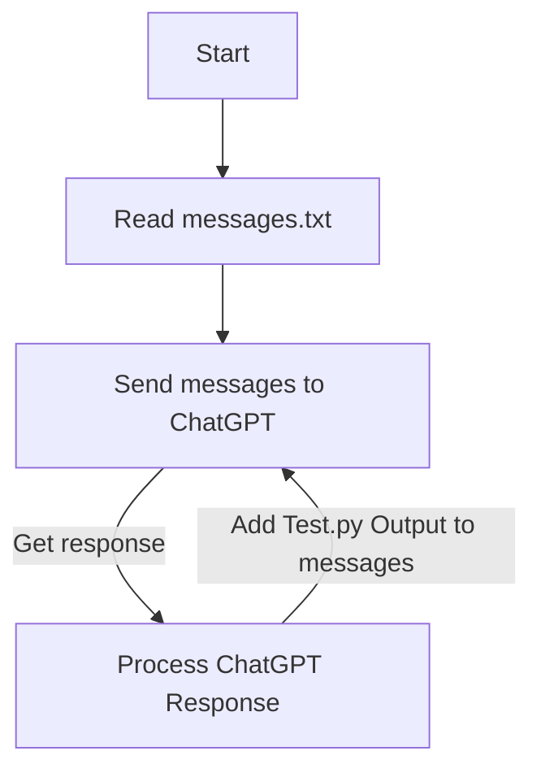
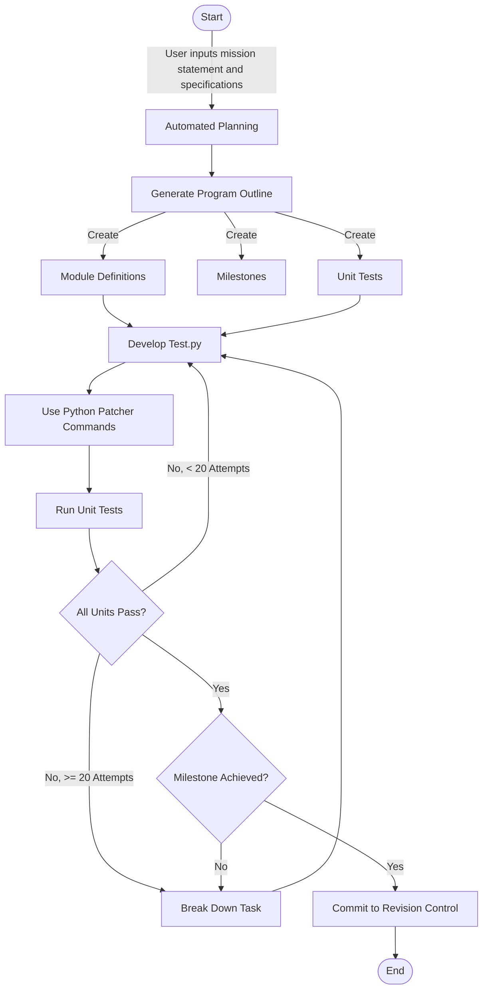

# ChatGPT Programmer: A Research Initiative into AI-Powered Coding

The ChatGPT Programmer is a pioneering research project aimed at exploring the potential for automated programming through the use of ChatGPT. Our ultimate ambition is to enable ChatGPT to autonomously write and execute code, pushing the boundaries of AI-assisted software development.

## Getting Started

To get started with ChatGPT Programmer:

1. Obtain an API key from [OpenAI's API platform](https://platform.openai.com/api-keys).
2. Set an environment variable `OPENAI_API_KEY` with your obtained key.
3. Execute `ChatGPT_Programmer.py` to run the program.

## Overview of Operation

The process unfolds as follows:

Upon running `ChatGPT_Programmer.py`, the system begins by reading `messages.txt`, which contains the exchange history with ChatGPT, including any instructions for editing and running Python code via the "Python Patcher" (PP) commands. The objective communicated in `messages.txt` is to automate the execution of the `guess_number` function and facilitate the program's ability to guess numbers correctly through iterative trials.

## In Progress: The Future of ChatGPT Programming

The following diagram illustrates our vision for the end-to-end automated programming process:

## Components Explained

- **ChatGPT Programmer**: This interface leverages the OpenAI API to automatically generate and run code, driven by user inputs and predefined project criteria.
- **Python Patcher (PP)**: This innovative tool refines and adjusts Python code, taking AI-generated suggestions and integrating them into existing codebases, thereby enhancing functionality and addressing complex code transformations.
- **Test.py**: This is the output file where the system stores the newly generated or modified code. It serves as the cornerstone for verification by the test runner to ensure code integrity.
- **Test Runner**: The validation mechanism that rigorously tests the code in `Test.py` against established test cases to affirm its functionality.

## The Evolution of AI-Driven Development: From Manual to Autonomy

We currently reside in the nascent stages of AI-assisted programming, where AI provides code snippets and debugging assistance. The trajectory we envision spans from basic automation to full-fledged autonomous software development, marked by continuous learning and adaptation to the intricate world of software engineering. At each level, the AI's role expands from a simple assistant to an integral part of the development team, capable of handling increasingly complex tasks with minimal human intervention.

As we progress through each stage, we confront challenges that range from ensuring code quality to integrating AI within human-centric development teams. Nevertheless, our resolve is to navigate through these complexities, fostering an AI that not only codes but also learns, adapts, and collaborates effectively in the dynamic landscape of software development.

## Moving Forward

The ChatGPT Programmer project is an ongoing journey—a blend of research, experimentation, and innovation—poised to redefine what is possible in the realm of automated programming.

### Level 1: Basic Automation
- **User Input**: Ask ChatGPT or another AI to write code.
- **Output**: AI provides code snippets.
- **User Action**: User manually pastes code into an editor, runs, and debugs it.

### Level 2: Integrated Development
- **Automation**: Integration with code editors via plugins.
- **User Action**: Commands are sent directly from the editor to AI services, and code is inserted at the cursor.

### Level 3: Simple Autonomy
- **Automation**: AI can write simple scripts and run them.
- **User Action**: The user might still need to debug or rewrite code.

### Level 4: Test-Driven Development Assistance
- **Automation**: AI assists in writing unit tests based on user specifications.
- **User Action**: User reviews and runs tests.

### Level 5: Debugging Assistance
- **Automation**: AI suggests fixes for common bugs and can step through simple debugging tasks.
- **User Action**: The user must validate and integrate suggestions.

### Level 6: Code Management
- **Automation**: AI assists with version control, offering to commit changes and manage simple merges.
- **User Action**: User oversees version control decisions.

### Level 7: Advanced Autonomy
- **Automation**: AI creates program outlines, decides on modules, and drafts milestones autonomously.
- **User Input**: User provides mission statement and specifications.

### Level 8: Autonomous Test and Development Loop
- **Automation**: AI develops modules and unit tests iteratively, running tests until all units pass.
- **User Oversight**: The user monitors progress and may adjust specifications or provide guidance.

### Level 9: Problem Decomposition
- **Automation**: If tasks are not achieved, AI breaks them down into smaller steps autonomously.
- **User Interaction**: User may need to clarify or provide additional information if the AI struggles.

### Level 10: Full Autonomy
- **Automation**: Complete end-to-end development process with minimal user input. AI handles code generation, testing, debugging, and commits to revision control. It assesses progress and refactors tasks autonomously.
- **User Action**: User provides the initial input and possibly some high-level oversight.

### Beyond Level 10: Continuous Learning and Improvement
- **Automation**: AI would not only develop software but also learn from each interaction to improve its understanding of user needs, coding practices, and debugging strategies.

### Challenges and Considerations:
- **Complexity of Tasks**: As tasks become more complex, the need for sophisticated understanding of software architecture, business logic, and nuanced user requirements increases.
- **Quality Assurance**: Ensuring that the AI-generated code is secure, efficient, and maintainable is crucial.
- **Human Oversight**: No matter how advanced, AI systems will likely require human oversight to ensure that outputs meet user expectations and adhere to ethical standards.
- **Scalability**: Handling large-scale software projects requires an understanding of multiple interconnected systems and their dependencies.
- **Adaptability**: The AI must adapt to evolving programming languages, frameworks, and technologies.
- **Collaboration**: Integrating AI into human teams poses social and technical challenges.

We're currently closer to the early levels, with tools that can generate code snippets and offer debugging suggestions. However, as AI technology advances, particularly with the development of more sophisticated machine learning models and better integration into software development tools and workflows, higher levels of autonomy could become achievable.
